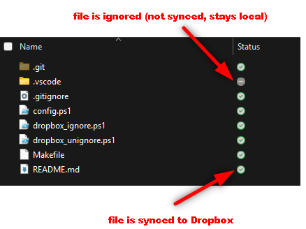

# 🛡️ dbignore

**dbignore** is a simple script that marks unwanted files and folders as ignored by Dropbox — without deleting them from your local machine.

- 💡 Originally built for personal use, but shared publicly in case others find it helpful
- 🧪 Simple, scriptable, and non-invasive — no installs, no Python dependency
- 🔐 Privacy-aware: keeps sensitive files local without relying on Dropbox settings

Built by a data scientist for data science workflows — but useful for **anyone** who wants to stop Dropbox from syncing sensitive or heavy files while keeping them local.

## 🔧 How It Works

Dropbox supports marking files and folders as **"ignored"**. This script finds common junk, temp, and sensitive files/folders, and marks them so Dropbox stops syncing them — but leaves them on disk.

You’ll see Dropbox status icons update in File Explorer:

- ✅ Green check = synced
- ➖ Gray minus = ignored (local only)




## ✅ Requirementss

- Windows with PowerShell
- Dropbox desktop app installed
- Make - for easier command execution

To install `make` with **Chocolatey**:

```bash
choco install make
```

> 💡 If you don’t have Chocolatey, install it from [https://chocolatey.org/install](https://chocolatey.org/install#individual) first.


## 🔧 Setup

1. Clone the repo
```bash
git clone https://github.com/lisekarimi/dbignore.git
cd dbignore
```

2. Open `dropbox_ignore.ps1` and change this line to your own Dropbox project path:
```bash
$parentFolder = "C:\Users\username\Dropbox"
```

3. Open `dropbox_ignore.ps1` and update the arrays with files, folders, or extensions to ignore.

```powershell
$targetNames = @(
  # exact file or folder names (no wildcards)
)

$extensions = @(
  # file extensions to ignore (e.g., ".pkl", ".log")
)
```

Save

4. Open a terminal in the project folder and run
```bash
make ignore
```

This will run the PowerShell script and apply the ignore rules.


## 🧹 Safe & Reversible

Ignored items are:

- **Removed from Dropbox cloud**
- **Kept locally**
- **Can be un-ignored anytime** using the `make unignore` command. Just edit `dropbox_unignore.ps1` and add the files or folders you want Dropbox to stop ignoring.

---

Made with ❤️ by Lise

